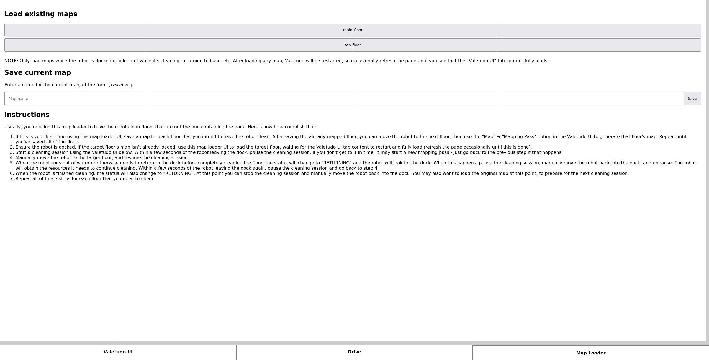
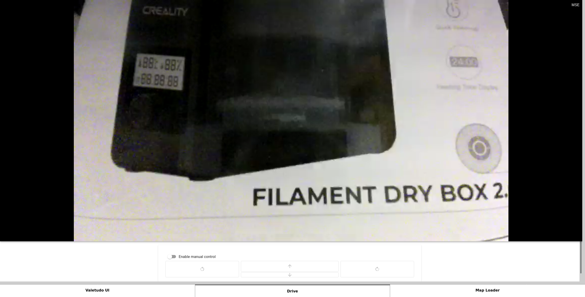
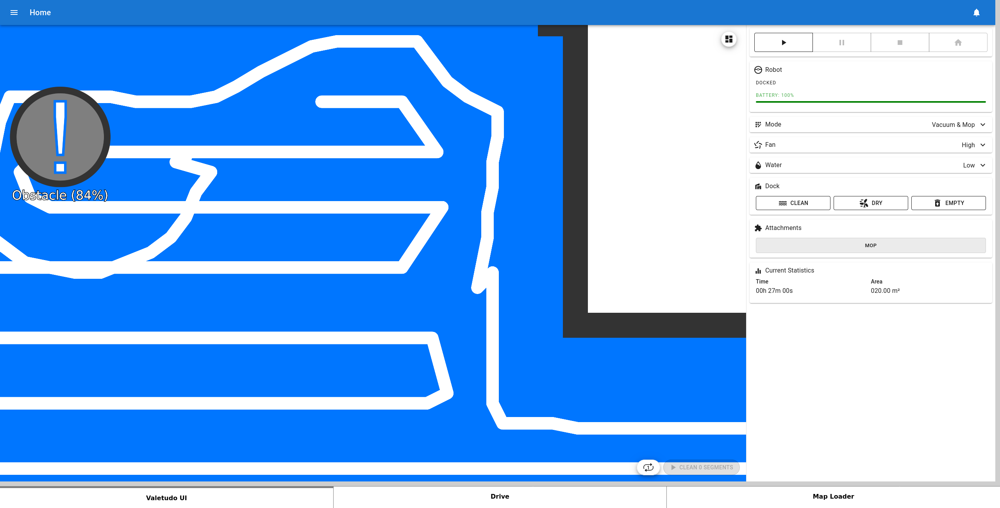

Dreame Maploader Web UI
=======================

A web UI for Dreame robots that extends Valetudo with additional features.

Saving and loading multiple maps:



Realtime browser-based video streaming from the front-facing camera (if present), plus manual controls for driving the robot around (if you look carefully, this is actually a carefully-positioned iframe containing the Valetudo UI).



Accessing the regular Valetudo UI in the "Valetudo UI" tab:



Setup
-----

I strongly recommend following my [Dreame robot setup overview](https://anthony-zhang.me/blog/offline-robot-vacuum), which covers setting up this web UI, but also includes basic security measures such as setting up an onboard firewall and hardening SSH. However, if you already have a setup you're happy with, the instructions below should get you started with the web UI.

1. Download [`dreame-maploader-web-ui`](./dreame-maploader-web-ui) and [`map-loaded.wav`](./map-loaded.wav).
2. Copy `dreame-maploader-web-ui` and `map-loaded.wav` to the robot via SCP (or however you prefer to transfer files), replacing `ROBOT_IP_ADDRESS` below with the actual IP address of your robot:

```sh
scp dreame-maploader-web-ui root@ROBOT_IP_ADDRESS:/data/dreame-maploader-web-ui
scp map-loaded.wav root@ROBOT_IP_ADDRESS:/data/map-loaded.wav
```

3. SSH into the robot, then run the following to make the web UI auto-start on boot (change the `--robot` option to match your robot model):

```sh
cat <<EOF >> /data/_root_postboot.sh

if [[ -f /data/dreame-maploader-web-ui ]]; then
    /data/dreame-maploader-web-ui --robot="Dreame L10S Ultra" --port=80 --save_path=/data/saved_maps --valetudo_port=3000 > /dev/null 2>&1 &
fi
EOF
reboot
```

4. SSH into the robot, then in `/data/valetudo_config.json`, change the `"port"` setting (under `"webserver"`) from `80` to `3000`. This causes the Valetudo UI to be served on port 3000 rather than port 80.

You can now access the web UI using your web browser at `http://ROBOT_IP_ADDRESS`, replacing `ROBOT_IP_ADDRESS` below with the actual IP address of your robot.

Rationale
---------

Valetudo [intentionally doesn't support multiple maps](https://valetudo.cloud/pages/general/why-not-valetudo.html#no-multi-floormulti-map-support), because supporting many different vendors in a clean way would be very hard to maintain, and would likely require ugly hacks - a very reasonable decision for a general-purpose robot de-clouding project! You could try moving the entire dock and doing a whole new mapping pass each time you move the robot to a different floor, but that takes a while, and doesn't properly prepare the robot for mopping (e.g. it doesn't wash the mop pads at the beginning of a cleaning session).

A fork of Valetudo called [Valetudo RE](https://github.com/rand256/valetudo) adds this functionality, but only for Roborock robots, not Dreame ones. Someone made a map save/load tool for Dreame robots, called [Dreame Vacuum Robot Maploader](https://github.com/pkoehlers/maploader), but it only allows triggering map changes via MQTT, and doesn't otherwise expose any controls or UI.

Valetudo also [intentionally doesn't support video streaming from a robot's onboard cameras](https://github.com/Hypfer/Valetudo/discussions/1723#discussioncomment-5120231), for security reasons and because IP cameras are a better solution in general, also a very reasonable decision.

However, I think that any attacker able to break into the robot could easily access the onboard camera anyways, and that it would take at most an hour for someone capable. In my opinion, the best course of action would be to better secure the robot to begin with. In the blog post I link to in the "Setup" section, I described various ways to better lock down access to the robot by setting up an onboard firewall and hardening SSH.

I didn't want to fork Valetudo to implement just a few features, knowing that my changes would not be upstreamable. So instead, this web UI replaces Valetudo's web UI, wrapping it in an iframe, while also providing other functionality independently of Valetudo. It's a very hacky approach, but allows you to use all of these features with a regular, unmodified Valetudo install. In the setup guide, you first reconfigure Valetudo's UI to be served on port 3000 instead of port 80. Then, you install this web UI, which takes over port 80 instead, and shows an iframe of the Valetudo UI running on port 3000.

The map save/load functionality in this web UI is similar to how Dreame Vacuum Robot Maploader does it, which is essentially to swap out the entire map data folder and restarting the robot's control processes - it's a bit of a fragile approach, but it is fully functional and works decently well. Using the map loader is a little janky because you have to keep an eye on the robot, and move it to and from the dock when it runs out of water - roughly once every 15 minutes or so. Still a lot less annoying than mopping and vacuuming by hand, though.

I've mainly tested this on a Dreame L10s Ultra, even though it should support several other Dreame robots.

It serves a web app on port 80 and replaces Valetudo, which you should reconfigure to listen on port 3000 instead. The web app then embeds Valetudo within an iframe, with tabs for all of the other functionality that it provides.

Development
-----------

The build process is very similar to [Valetudo's process](https://github.com/Hypfer/Valetudo/blob/master/backend/package.json). Make sure you have Node v20+, then run:

```sh
npm install -g @yao-pkg/pkg
pkg --targets node20-linuxstatic-arm64 --no-bytecode --public dreame-maploader-web-ui.js
```

The result, `dreame-maploader-web-ui`, is a standalone executable capable of running directly on the robot.
